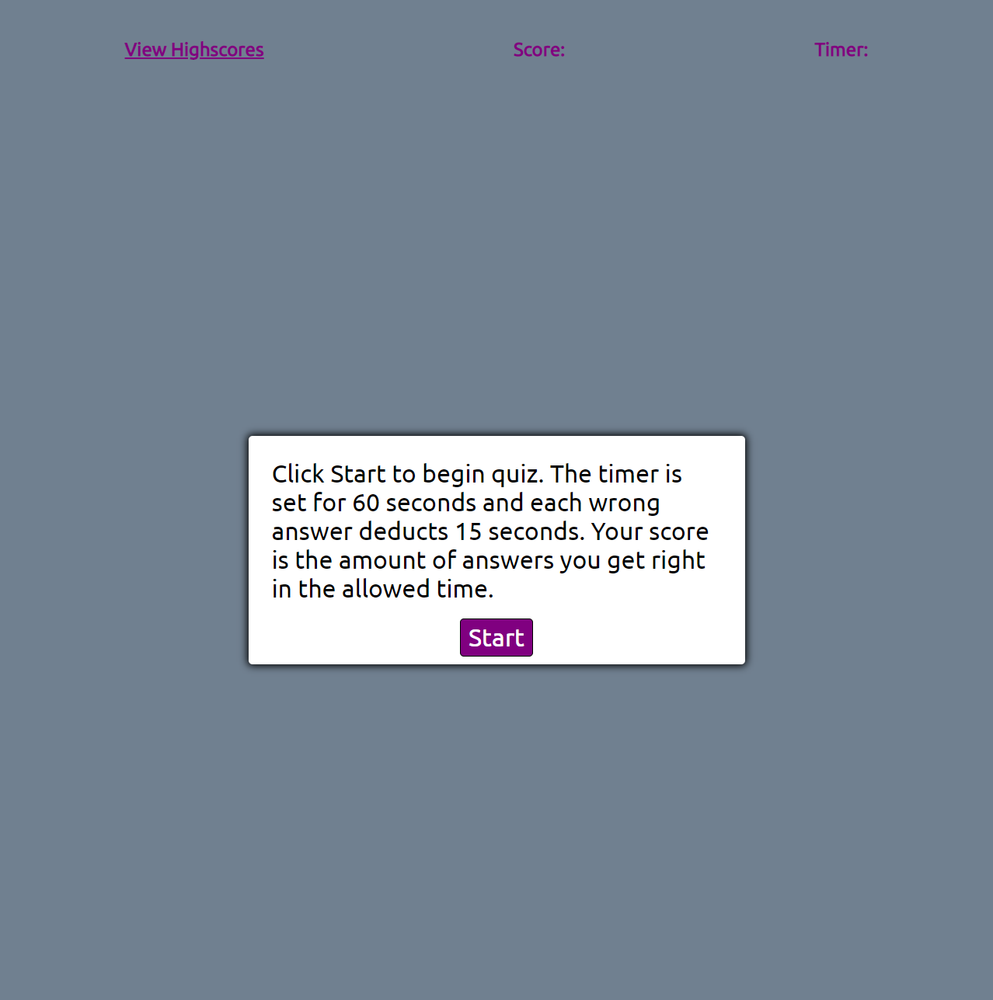

# JS-Quiz

In this project I built a coding quiz from scratch using HTML, CSS, and JavaScript. Applying what I learned in class I was able to have four questions display in order after clicking a start button. The application will let yo know if the answers were right or wrong and you get 60 seconds to answer all questions. At the end you are presented with an input field to store your initials and your score to local storage. I created this repository and commited all changes to this branch. I also made the project live with Github pages. 

Link to deployed project: https://nickwojt.github.io/js-quiz/

